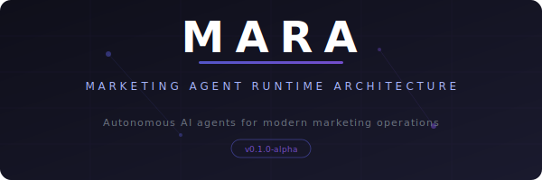

<p align="center">
  
</p>

<h1 align="center">MARA</h1>
<h3 align="center">Marketing Agent Runtime Architecture</h3>

<p align="center">
  <em>An open-source framework for building, orchestrating, and deploying autonomous AI marketing agents.</em>
</p>

<p align="center">
  <a href="#quickstart">Quickstart</a> •
  <a href="#architecture">Architecture</a> •
  <a href="#agents">Agents</a> •
  <a href="#pipelines">Pipelines</a> •
  <a href="#roadmap">Roadmap</a> •
  <a href="#contributing">Contributing</a>
</p>

---

## The Problem

Marketing teams are using AI the same way they used spreadsheets in 2005 — manually, one task at a time, with no system architecture behind it. Prompting a chatbot to write ad copy is not an AI strategy. It's a shortcut with no compounding value.

The industry needs infrastructure, not tools. Marketing workflows are inherently multi-step, data-dependent, and feedback-driven — the exact characteristics that make them ideal candidates for agentic AI systems.

## What is MARA?

**MARA (Marketing Agent Runtime Architecture)** is a modular Python framework for building autonomous AI agents that execute real marketing workflows — competitor intelligence, audience research, content generation, campaign analysis, and cross-channel optimization.

MARA treats marketing operations the way modern DevOps treats infrastructure: as **programmable, composable, and intelligent pipelines** where specialized agents handle discrete functions and coordinate through a shared runtime.

### Core Principles

- **Agent Specialization** — Each agent owns a specific marketing function and maintains domain context across executions.
- **Pipeline Composition** — Agents chain into multi-step workflows where outputs become inputs, enabling complex operations from simple components.
- **Memory & State** — Agents persist context across runs, building institutional knowledge that improves with every execution cycle.
- **Model Agnostic** — Designed to work with any LLM provider (OpenAI, Anthropic, local models) through a unified interface layer.
- **Human-in-the-Loop** — Configurable approval gates for high-stakes actions. Full autonomy is a spectrum, not a switch.

---

## Architecture

```
┌─────────────────────────────────────────────────────┐
│                   MARA Runtime                       │
│  ┌───────────┐  ┌───────────┐  ┌───────────────┐   │
│  │  Agent     │  │  Pipeline  │  │   Memory      │   │
│  │  Registry  │  │  Engine    │  │   Store       │   │
│  └─────┬─────┘  └─────┬─────┘  └───────┬───────┘   │
│        │              │                 │            │
│  ┌─────▼──────────────▼─────────────────▼───────┐   │
│  │              Orchestration Layer               │   │
│  └─────┬──────────────┬─────────────────┬───────┘   │
│        │              │                 │            │
│  ┌─────▼─────┐  ┌─────▼─────┐  ┌───────▼───────┐   │
│  │ Research   │  │ Content   │  │  Optimization │   │
│  │ Agents     │  │ Agents    │  │  Agents       │   │
│  └───────────┘  └───────────┘  └───────────────┘   │
└─────────────────────────────────────────────────────┘
         │              │                 │
    ┌────▼────┐   ┌─────▼────┐   ┌───────▼──────┐
    │  Data   │   │   LLM    │   │   External   │
    │ Sources │   │ Providers│   │   Platforms   │
    └─────────┘   └──────────┘   └──────────────┘
```

### Components

**Agent Registry** — Discovers, validates, and manages the lifecycle of all registered agents. Handles dependency resolution between agents that share data.

**Pipeline Engine** — Compiles agent chains into executable workflows. Supports sequential, parallel, and conditional branching patterns. Handles retry logic, fallbacks, and execution telemetry.

**Memory Store** — Persistent context layer that agents read from and write to across executions. Supports both short-term (session) and long-term (historical) memory with configurable retention policies.

**Orchestration Layer** — Routes data between agents, manages execution order, and enforces approval gates. The traffic controller for the entire system.

---

## Quickstart

### Installation

```bash
pip install mara-ai
```

Or install from source:

```bash
git clone https://github.com/YOUR_USERNAME/mara.git
cd mara
pip install -e .
```

### Configuration

```bash
cp .env.example .env
# Add your LLM provider API keys
```

### Your First Agent

```python
from mara import Agent, AgentConfig

class CompetitorResearchAgent(Agent):
    """Monitors competitor activity and surfaces strategic insights."""

    config = AgentConfig(
        name="competitor_research",
        description="Tracks competitor positioning, messaging, and market moves",
        memory_enabled=True,
        approval_required=False,
    )

    async def execute(self, context):
        competitors = context.get("competitors", [])

        research = await self.analyze(
            task="competitor_landscape",
            data=competitors,
            instructions="""
                For each competitor, identify:
                1. Current positioning and primary messaging
                2. Recent strategic changes (pricing, features, partnerships)
                3. Content strategy patterns and channel focus
                4. Gaps and vulnerabilities in their approach
            """,
        )

        await self.memory.store("competitor_intel", research)
        return research
```

### Your First Pipeline

```python
from mara import Pipeline

pipeline = Pipeline(
    name="weekly_competitive_intel",
    description="Full competitive analysis with strategic recommendations",
)

pipeline.add_stage("research", CompetitorResearchAgent())
pipeline.add_stage("audience", AudienceAnalysisAgent())
pipeline.add_stage("strategy", StrategyAgent(), depends_on=["research", "audience"])
pipeline.add_stage("report", ReportGenerationAgent(), depends_on=["strategy"])

results = await pipeline.run(
    context={
        "competitors": ["competitor_a", "competitor_b", "competitor_c"],
        "audience_segments": ["enterprise", "smb"],
    }
)
```

---

## Agents

MARA ships with a set of foundational agents that cover core marketing functions. Each can be used standalone or composed into pipelines.

| Agent | Function | Status |
|-------|----------|--------|
| `CompetitorResearchAgent` | Competitive landscape monitoring and analysis | ✅ Stable |
| `AudienceAnalysisAgent` | Audience segmentation and behavioral insights | ✅ Stable |
| `ContentStrategyAgent` | Content planning, gap analysis, and editorial calendars | ✅ Stable |
| `CampaignAnalysisAgent` | Performance analysis and optimization recommendations | 🔨 Beta |
| `SEOResearchAgent` | Keyword research, SERP analysis, and technical SEO audits | 🔨 Beta |
| `BrandVoiceAgent` | Brand consistency scoring and voice alignment | 🧪 Alpha |
| `MarketSignalAgent` | Trend detection and market opportunity identification | 🧪 Alpha |

### Custom Agents

Building a custom agent takes minutes:

```python
from mara import Agent, AgentConfig

class MyCustomAgent(Agent):
    config = AgentConfig(
        name="my_agent",
        description="What this agent does",
        memory_enabled=True,
    )

    async def execute(self, context):
        result = await self.analyze(
            task="your_task",
            data=context.get("input_data"),
            instructions="Your agent's instructions here",
        )
        return result
```

---

## Pipelines

Pipelines are where MARA's power compounds. Chain agents into workflows that mirror how marketing actually operates — research informs strategy, strategy drives content, content generates data, data refines strategy.

### Pipeline Patterns

**Sequential** — Agents execute in order, each receiving the output of the previous stage.

```python
pipeline.add_stage("research", ResearchAgent())
pipeline.add_stage("strategy", StrategyAgent(), depends_on=["research"])
pipeline.add_stage("content", ContentAgent(), depends_on=["strategy"])
```

**Parallel** — Independent agents execute simultaneously, results merge at a convergence point.

```python
pipeline.add_stage("seo_research", SEOAgent())
pipeline.add_stage("competitor_research", CompetitorAgent())
pipeline.add_stage("synthesis", SynthesisAgent(), depends_on=["seo_research", "competitor_research"])
```

**Conditional** — Execution branches based on runtime conditions.

```python
pipeline.add_stage(
    "deep_dive",
    DeepDiveAgent(),
    condition=lambda ctx: ctx["research"].confidence_score < 0.7,
)
```

---

## Configuration

MARA uses a layered configuration system:

```yaml
# mara.config.yaml
runtime:
  max_concurrent_agents: 5
  default_timeout: 300
  retry_policy:
    max_retries: 3
    backoff_factor: 2

memory:
  backend: "sqlite"        # sqlite | redis | postgres
  retention_days: 90
  embedding_model: "default"

llm:
  provider: "anthropic"    # anthropic | openai | local
  model: "claude-sonnet-4-20250514"
  temperature: 0.3
  max_tokens: 4096

approval:
  default: false
  high_stakes_actions: true
  notification_channel: "slack"
```

---

## Roadmap

### v0.1.0 — Foundation (Current)
- [x] Core agent runtime and lifecycle management
- [x] Pipeline engine with sequential and parallel execution
- [x] Memory store (SQLite backend)
- [x] Anthropic and OpenAI provider support
- [x] Foundational agent library (research, audience, content, campaign)

### v0.2.0 — Intelligence Layer
- [ ] Cross-agent learning and shared knowledge graphs
- [ ] Automated pipeline optimization based on execution history
- [ ] Advanced memory with semantic search and contextual retrieval
- [ ] Real-time data source integrations (Google Analytics, social APIs)

### v0.3.0 — Autonomy
- [ ] Self-improving agents that refine their own prompts based on outcomes
- [ ] Multi-objective optimization across competing marketing KPIs
- [ ] Autonomous campaign management with configurable guardrails
- [ ] Natural language pipeline builder

### v1.0.0 — Production Runtime
- [ ] Enterprise deployment tooling (Docker, Kubernetes)
- [ ] Team collaboration and shared agent libraries
- [ ] Audit logging and compliance controls
- [ ] Plugin marketplace for community agents

---

## Philosophy

Marketing is one of the last major business functions still run primarily on human intuition and manual execution. Finance has quant models. Engineering has CI/CD. Supply chain has optimization algorithms. Marketing has... a content calendar and some A/B tests.

MARA exists because the gap between what AI can do for marketing and what marketers are actually doing with AI is enormous. The bottleneck is not intelligence — it is architecture. Individual prompts don't compound. Agents operating within a structured runtime do.

The future of marketing is not human OR machine. It is human-directed, machine-executed systems that learn from every cycle and operate at a speed and scale that no team can match manually.

MARA is the infrastructure for that future.

---

## Contributing

MARA is in active development. Contributions, ideas, and feedback are welcome.

```bash
# Fork the repo
git clone https://github.com/YOUR-USERNAME/mara.git
cd mara

# Create a virtual environment
python -m venv venv
source venv/bin/activate

# Install dev dependencies
pip install -e ".[dev]"

# Run tests
pytest
```

See [CONTRIBUTING.md](docs/CONTRIBUTING.md) for detailed guidelines.

---

## License

MIT License. See [LICENSE](LICENSE) for details.

---

<p align="center">
  <em>Built for the marketers who see what's coming.</em>
</p>
